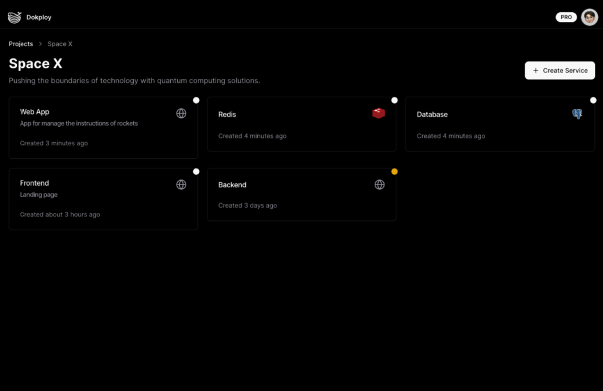

# HomeDock Deployment on OCI Free Tier

This Terraform project deploys a HomeDock instance along with worker nodes in Oracle Cloud Infrastructure (OCI) Free Tier. **HomeDock** is an open-source platform to manage your app deployments and server configurations.

## Deploy

_Clicking the "Deploy to Oracle Cloud" button will load the Oracle Cloud Resource Manager to deploy the infrastructure described in this Terraform project. During deployment, you'll be prompted to configure the stack parameters. Review the settings, then launch the stack deployment._

## About HomeDock

HomeDock is an open-source deployment tool designed to simplify the management of servers, applications, and databases on your own infrastructure with minimal setup. It streamlines CI/CD pipelines, ensuring easy and consistent deployments.

For more information, visit the official page at [homedock.com](https://homedock.com).

## OCI Free Tier Overview

Oracle Cloud Infrastructure (OCI) offers a Free Tier with resources ideal for light workloads, such as the VM.Standard.E2.1.Micro instance. These resources are free as long as usage remains within the limits.

For detailed information about the free tier, visit [OCI Free Tier](https://www.oracle.com/cloud/free/).

_Note: Free Tier instances are subject to availability, and you might encounter "Out of Capacity" errors. To bypass this, upgrade to a paid account. This keeps your free-tier benefits but removes the capacity limitations, ensuring access to higher-tier resources if needed._

## Prerequisites

Before you begin, ensure you have the following:

- An Oracle Cloud Infrastructure (OCI) account with Free Tier resources available.
- An SSH public key for accessing the instances.

## Servers & Cluster

### Add Servers to HomeDock

To begin deploying applications, you need to add servers to your HomeDock cluster. A server in HomeDock is where your applications will be deployed and managed.

#### Steps to Add Servers:

1.  **Login to HomeDock Dashboard**:
    - Access the HomeDock dashboard via the main instance's public IP address. You'll need to use the login credentials configured during setup.
1.  **Generate SSH Keys**:
    - On the left-hand menu, click on "SSH Keys" and add your private and public SSH key to connect your server.
1.  **Navigate to Servers Section**:
    - On the left-hand menu, click on "Servers" and then "Add Server."
1.  **Fill in Server Details**:
    - **Server Name**: Give your server a meaningful name.
    - **IP Address**: Enter the public IP address of the instance. If you’re using private networking, you can enter the private IP address instead.
    - **SSH Key**: Select the previous created SSH key.
    - **Username**: The SSH user for connecting to the server, use `root`.
1.  **Submit**:
    - After filling out the necessary fields, click "Submit" to add the server.

### Configure a HomeDock Cluster with new workers

After setting up the main HomeDock instance, you can expand your cluster by adding worker nodes. These worker instances will help distribute the workload for your deployments.

See more info about configuring your cluster on the [HomeDock Cluster Docs](https://docs.homedock.com/docs/core/cluster).

## Project Structure

- `bin/`: Contains bash scripts for setting up HomeDock on both the main instance and the worker instances.
  - `homedock-main.sh`: Script to install HomeDock on the main instance.
  - `homedock-worker.sh`: Script to configure necessary dependencies on worker instances.
- `helper.tf`: Contains helper functions and reusable modules to streamline the infrastructure setup.
- `doc/`: Directory for images used in the README (e.g., screenshots of HomeDock setup).
- `locals.tf`: Defines local values used throughout the Terraform configuration, such as dynamic values or reusable expressions.
- `main.tf`: Core Terraform configuration file that defines the infrastructure for HomeDock's main and worker instances.
- `network.tf`: Configuration for setting up the required OCI networking resources (VCNs, subnets, security lists, etc.).
- `output.tf`: Specifies the output variables such as the IP addresses for the dashboard and worker nodes.
- `providers.tf`: Declares the required cloud providers and versions, particularly for Oracle Cloud Infrastructure.
- `README.md`: This file, providing instructions on deployment and usage.
- `variables.tf`: Defines input variables used in the project, including compartment ID, SSH keys, instance shape, and more.

## Terraform Variables

Below are the key variables for deployment which are defined in `variables.tf`:

- `ssh_authorized_keys`: Your SSH public key for accessing the instances.
- `compartment_id`: OCI compartment ID for instance deployment.
- `num_worker_instances`: Number of worker instances to deploy for HomeDock.
- `availability_domain_main`: Availability domain for the main instance.
- `availability_domain_workers`: Availability domains for worker instances.
- `instance_shape`: Instance shape (e.g., VM.Standard.E2.1.Micro) used for deployment.
- `memory_in_gbs`: Memory size (GB) per instance.
- `ocpus`: Number of OCPUs per instance.
